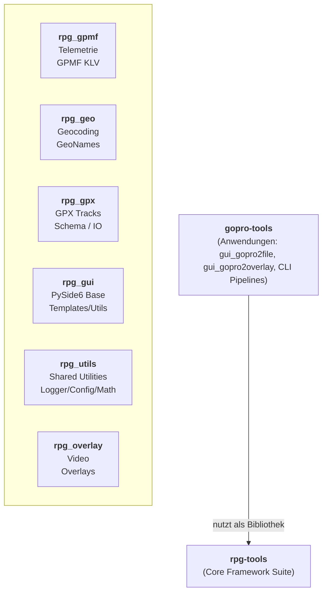

# RPG Tools Framework Suite

Eine leistungsfähige, modulare Python-Framework-Suite zur Extraktion und Verarbeitung von **GoPro-Telemetriedaten (GPMF)**, Erzeugung von **GPX-Tracks**, **Geokodierung**, **Karten-Rendering**, **Video-Overlays** sowie wiederverwendbaren **PySide6-UI-Utilities**.

---

## 🏗️ Architektur & Modul-Übersicht

Das Framework **rpg-tools** stellt die zentrale Bibliothek dar, auf der Anwendungs-Suites wie **[gopro-tools](https://github.com/RalfPeter/gopro-tools)** (GUIs und CLI-Skripte) aufbauen:

---

---

## rpg_gpx
